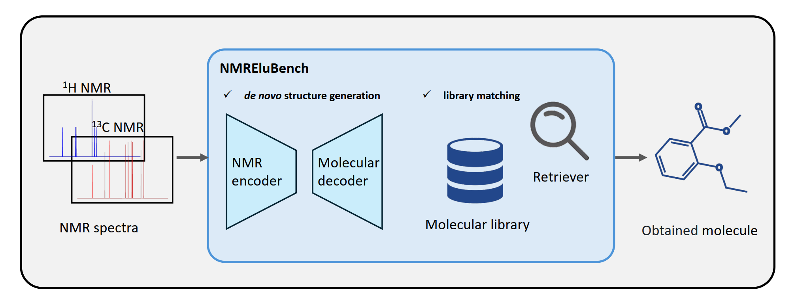

# 🔬 NMREluBench: Benchmarking Molecular Structure Elucidation from Experimental NMR Chemical Shifts



[](https://huggingface.co/datasets/yqj01/NMREluBench)
[](https://zenodo.org/records/15440162)
[](https://github.com/Colin-Jay/NMREluBench)
<!-- [](https://arxiv.org/abs/2XXX.XXXXX) -->

## 🎯 Overview

**NMREluBench** is a comprehensive benchmark specifically designed for evaluating deep learning models on the inverse elucidation of molecular structures from experimental <sup>1</sup>H and <sup>13</sup>C NMR chemical shifts. This benchmark addresses a critical gap in computational chemistry by providing standardized evaluation protocols for NMR-based structure determination.

### ✅ Key Features

- 📈 **Two Core Tasks**: *De novo* structure generation and library matching
- 🧪 **Experimental Data Focus**: Real-world NMR chemical shifts from experimental measurements
- 🔄 **Comparative Analysis**: Performance evaluation against computed NMR datasets
- 📊 **Standardized Metrics**: Rigorous evaluation protocols for fair model comparison
- 🌐 **Open Source**: Publicly available for research and development

## 🚀 Quick Start

### 📁 Dataset Structure

```
NMREluBench/
├── nmr_denovo/         # De novo structure generation task
│   ├── ...             # Task-specific code
│   └── README.md       # Task-specific documentation
├── nmr_retrieval/      # Library matching task
│   ├── ...             # Task-specific code
│   └── README.md       # Task-specific documentation
└── README.md           # NMREluBench documentation
```

## 📋 Tasks Overview

### 🎨 Task 1: [De Novo Structure Generation](./nmr_denovo/)

Generate molecular structures directly from experimental NMR chemical shifts without prior knowledge of potential candidates.

**Input**: <sup>1</sup>H and <sup>13</sup>C NMR chemical shifts  
**Output**: Molecular structure (Smiles or Selfies)  
**Evaluation**: For the _de novo_ molecular structure generation task, we report the overall molecular validity rate across all generated structures ($R_{\text{valid}}$), along with Top-1 and Top-10 performance for structural match rate, MCES distance ($D_{\text{mces}}^{(1)}$, $D_{\text{mces}}^{(10)}$), and Tanimoto similarity ($S_{\text{tani}}^{(1)}$, $S_{\text{tani}}^{(10)}$). 

### 🔍 Task 2: [Library Matching](./nmr_retrieval/)

Identify the most likely molecular structure by matching experimental NMR data against a curated molecular library.

**Input**: <sup>1</sup>H and <sup>13</sup>C NMR chemical shifts  
**Output**: Ranked list of candidate structures from library  
**Evaluation**: For the library matching task, we use Top-1, Top-3, and Top-10 performance for structural match rate and MCES distance.

## 📚 Citation

Please kindly cite us after publication if you use our data or code.

## 📜 License

This project is licensed under the MIT License - see the [LICENSE](LICENSE) file for details.

## 🙏 Acknowledgments

This project is built upon the following open-source works, and we deeply appreciate the contributions of their authors:

### ✔️ Dataset & Baseline Methods
- **[NMRNet](https://github.com/Colin-Jay/NMRNet)** - Provided the NMR spectral dataset.  

### ✔️ Core Development Framework
- **[MassSpecGym](https://github.com/pluskal-lab/MassSpecGym)** - Our code is extended from this mass spectrometry toolkit.  

### ✔️ Model Architecture
- **[CMGNet](https://github.com/WJmodels/CMGNet)** - The BART-based model was adapted from this repository.  

We also thank the broader open-source community for enabling reproducible research.